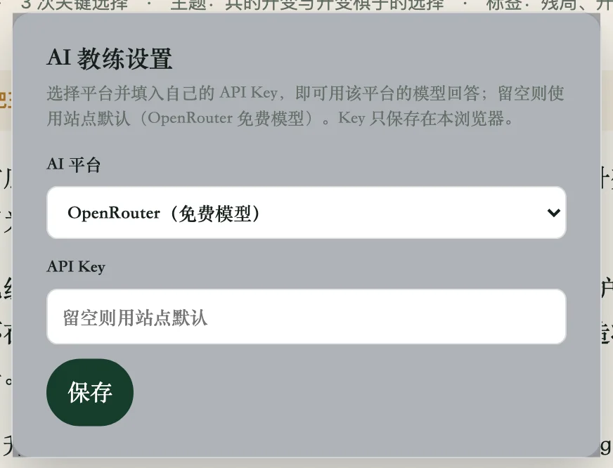
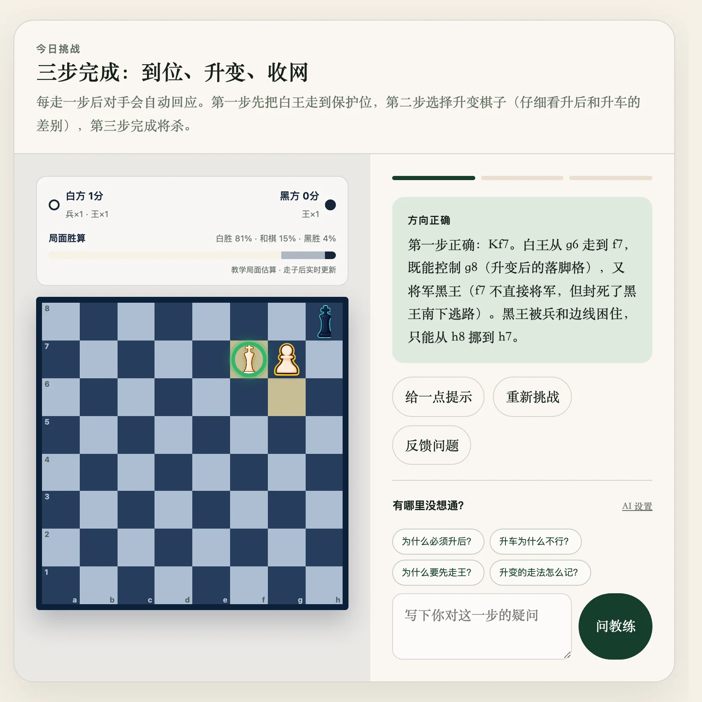

# AI Coach

## Summary

"Ask Coach" lets readers ask natural-language follow-up questions about the current position. The coach answers in the page language, prompt-constrained to explain ideas, rules and notation without ever revealing the lesson's solution. It works with zero setup (an embedded OpenRouter free-model key), supports bring-your-own keys, and falls back to pre-written answers when every AI path fails.

## Background

Roadmap milestone M4 called for an LLM-backed coach. The first version (2026-08-12) proxied Zhipu GLM-4-Flash through a Cloudflare Worker — but a Worker is still extra infrastructure between "zero setup for readers" and "zero servers for the maintainer". OpenRouter then proved to return CORS headers (direct browser calls allowed) with many `:free` models, making a no-server solution possible.

## Problem

1. Reader questions have a long tail: pre-written answers can't cover "what if I play the rook first?".
2. Most AI APIs block direct browser calls (no CORS headers), so the classic answer is a server-side proxy.
3. A coach that blurts out the standard answer destroys the "figure it out yourself" experience.

## Goals

- Visitors get real AI answers with zero action.
- Answers follow the page language (Chinese/English), ≤150 words, one point at a time.
- A hard constraint: never state the correct move sequence for the current challenge.
- Automatic degradation when any AI path is unavailable — the reader always gets a useful response.
- Bring-your-own key (OpenRouter / DeepSeek / Zhipu GLM), stored locally only.

## Non-Goals

- No accounts, billing or usage management.
- No AI availability guarantee (free models have no SLA).
- No conversation memory (each question is independent, carrying position context).
- The AI never judges move legality — that is the deterministic rules engine's job.

## Solution Overview

`assets/coach-ai.mjs` is a pure-logic layer (Node-testable); `app.js` orchestrates and renders. The fallback chain (high to low):

1. **User-configured provider + key** (localStorage), OpenAI-compatible requests straight to the chosen platform;
2. **Embedded OpenRouter key** (XOR + Base64 obfuscated, free models only): retries down the `OPENROUTER_MODELS` chain (primary model → fallbacks), surfacing the fallback reason;
3. **Cloudflare Worker proxy** (only when `CHESS_COACH_WORKER_URL` is injected at build time; currently unset);
4. **Keyless third-party relay** (Pollinations, experimental);
5. **Pre-written answers**: `defaultAnswer` plus the quick Q&A (`quick`), authored with the lesson.

The system prompt (Chinese and English variants) requires: explain rules/notation/ideas against the FEN; never say "the correct move is XX"; answer normally for off-topic questions. Each request carries the lesson title, goal, starting/current FEN and progress. 15-second timeout.

## User Experience

- Quick-question buttons (3–4 per lesson) fill and ask in one tap.
- The answer area labels its source: a real AI, or "pre-written reference" when degraded.
- The "AI Settings" panel switches provider/key or clears back to defaults at any time.

## Compatibility and Historical Impact

- On 2026-08-14 the AI settings panel was removed together with the embedded key, then restored the same day (`ca099c2`) when multi-provider BYO-key landed — the UI wobbled once; the final shape is "zero-config default + optional advanced settings".
- Fix `e9227c9`: English pages used to fall back to Chinese pre-written answers because `currentLang` was not imported.
- No breaking reader-facing changes: every new path layers on top of the pre-written answers.

## Data and Privacy Impact

Reader questions and position context are sent to the active AI platform (HTTPS). No other telemetry. See [Privacy](../privacy.md).

## Performance Impact

One network round trip per question (15 s timeout); free models occasionally rate-limit (observed ~1 in 4 empty answers or 429s), absorbed by retry and fallback.

## Limitations

- Free models have no SLA; at peak times the coach may degrade to pre-written answers entirely.
- The embedded key is obfuscation, not encryption (a deliberate trade-off, free models only; never embed a paid key).
- The coach cannot see the reader's wrong attempts on the board (context includes only the correct-path FEN progress).

## Release Information

Introduced: Unreleased (Worker version 2026-08-12; zero-config embedded key 2026-08-14; multi-provider settings panel 2026-08-27)

Status: Stable

## Related Documentation

- [Configuration](../configuration.md)
- [Privacy](../privacy.md)
- Maintainer setup details: `doc/AI_SETUP.md` (in-repo historical doc)

## Feature Changelog

### 2026-08-27

AI Settings panel supports bring-your-own keys for OpenRouter / DeepSeek / GLM.

### 2026-08-14

Embedded obfuscated OpenRouter key for zero-config free-model access; model retry and fallback chain; fixed the English-page language fallback; settings panel removed and restored.

### 2026-08-12

First version: Cloudflare Worker proxy for Zhipu GLM-4-Flash; experimental keyless relay; pre-written answer fallback.
