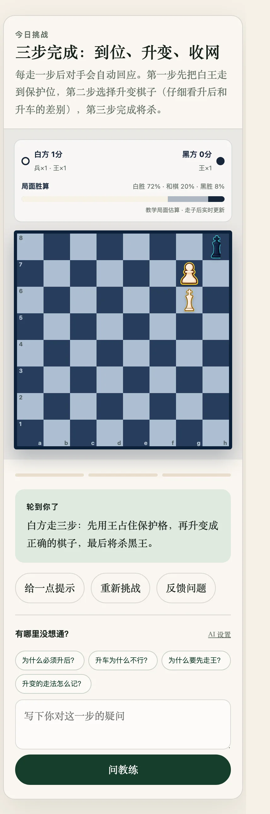

# Daily Homepage and Archive

## Summary

The homepage needs no manual maintenance: at build time it automatically features the lesson matching today's month/day, and all other lessons become archive cards. Authors only add lesson JSON; the homepage and archive stay correct on their own.

## Background

Early versions pinned the homepage to the newest lesson. As lessons accumulated, two issues appeared: readers couldn't find older lessons, and a "daily push" needs sensible behavior both when today has a lesson and when it doesn't.

## Problem

1. "Which lesson does today show?" must not depend on hand-edited HTML.
2. Older lessons must remain discoverable and connected (tags, prerequisites).
3. Archive card data (date, category, step count) must come from lesson data, never from hand copies.

## Goals

- Show the lesson whose `publishedAt` month/day equals today; fall back to the most recent lesson otherwise (across years too).
- Exclude the featured lesson from the archive to avoid duplication.
- Cards show date, edition, title, summary, category and step count — all from lesson data.
- Support `tags` and `prerequisites` links (dead links fail validation).

## Non-Goals

- No calendar view, curated collections or search.
- No read/unread state (no user system).
- No per-user personalization.

## Solution Overview

The selection logic lives in `pickHomepageLesson` (`scripts/content-lib.mjs`, a pure, testable function):

- prefer lessons whose `publishedAt` month/day equals today (year ignored, so content can recur across years);
- otherwise take the most recent lesson.

`build-site.mjs` renders every other lesson as an archive card; `prerequisites` slug arrays are resolved into localized local links at render time. Tests/CI can pin "today" via `CHESS_HOME_DATE` for reproducible builds.

Since 2026-08-11 (`2af3056`), lesson pages and the footer include a "Report" button that builds a mailto link pre-filled with the lesson ID, current FEN and move progress, so readers can report problems without describing the position.

## Compatibility and Historical Impact

Additive. The archive moved from "newest on top" to "today-first, latest-fallback"; no URLs changed (every lesson keeps `/<slug>.html` forever). No data migration.

## Data and Privacy Impact

The report button opens the local mail client (sent only after the user confirms); nothing is reported automatically.

## Limitations

- If several lessons share a date, one is chosen by ordering — no morning/evening split view.
- No pagination in the archive (six lessons so far, nowhere near needed).

## Release Information

Introduced: Unreleased (archive 2026-07-28; date-driven homepage and report button 2026-08-11)

Status: Stable

## Related Documentation

- [Usage Guide: Home and Archive](../usage.md#home-and-archive)
- [Development Guide: Lesson JSON Structure](../development.md#lesson-json-structure)

## Feature Changelog

### 2026-08-11

Date-driven homepage; in-page "Report" (mailto with position info).

### 2026-08-07

Tags (`tags`) and prerequisites (`prerequisites`) on archive cards and lesson pages, with dead-link validation.

### 2026-07-28

Automatic homepage and history list first shipped.
