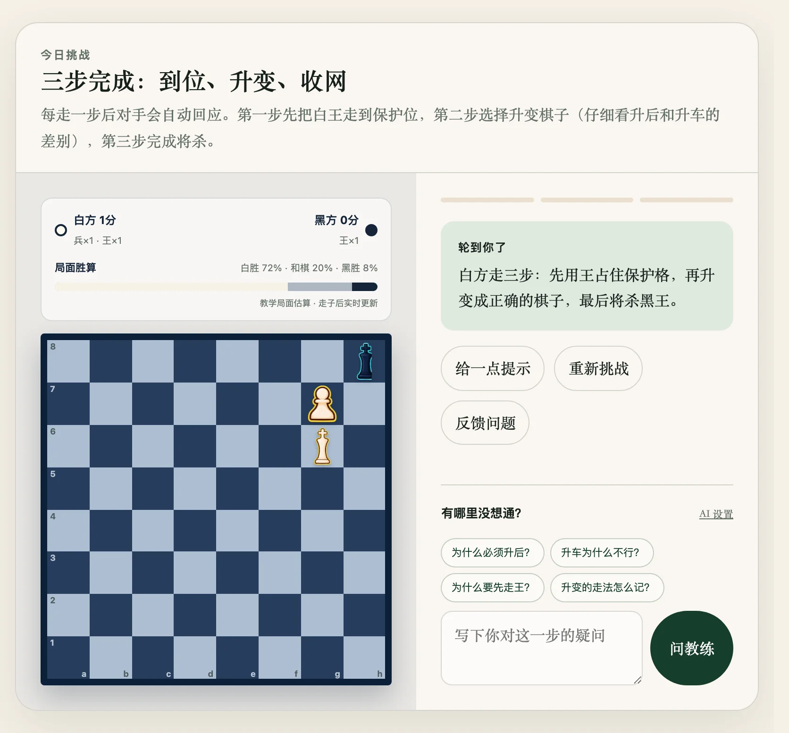

# Interactive Lessons

## Summary

Interactive lessons are the core form of Chess Moment: each lesson combines a short story with a 3–5 move board challenge. The reader plays the key moves by hand, gets instant green/red feedback with an explanation on every move, faces an automatic opponent reply after each correct step, and receives a review on completion.

## Background

The project began (before 2026-07-27) as a "chess daily push" for WeChat. Pure text articles immediately showed their limit: readers who only see a move list never truly learn, because the loop of "play it yourself, get it wrong, get corrected" is missing.

## Problem

When beginners study from static material:

1. a static move list cannot verify "can I actually play this?";
2. wrong moves go unexplained, so wrong intuitions solidify;
3. mobile lacks a no-signup, fast, three-minute practice format.

## Goals

- Each lesson: 3–5 key decisions, three to six minutes total.
- Both tap and drag input paths must work (touch-first).
- Instant feedback per move: correct (green), wrong (red + one-line reason), reasonable-but-not-best (amber explanation, no progress).
- Automatic opponent replies keep the rhythm of a real game.
- Self-contained pages: sharing one lesson's URL reproduces it with no extra requests.

## Non-Goals

- No free play or engine opponent (replies are scripted, one move per step).
- No general puzzle database or difficulty ladder (one lesson per day).
- No engine-grade analysis (the odds bar is a teaching estimate).
- No cross-device progress saving.

## Solution Overview

- Lesson JSON is inlined per page as `window.CHESS_LESSON`; the shared `assets/app.js` owns all interaction. No framework, no virtual DOM — direct DOM rendering.
- The board renders 64 `<button class="square">` elements with `` piece sprites; the 12 piece images are preloaded in `<head>` to avoid first-move flicker.
- Move legality is judged in the browser by `assets/chess-engine.mjs`; only legal targets are highlighted, so illegal moves cannot even be played.
- Feedback: `markMoveFeedback` attaches a green/red ring (with an animated halo) to the target square, fading after ~1 second; the status area shows the explanation text.
- The opponent-reply window: after a correct move the board locks (`awaitingOpponent`) until the reply lands; the reply move is re-validated, and a failure produces an explicit error plus unlock — the user can never get stuck.
- Alternatives (`alternatives`): an amber explanation, but `step` does not advance.
- Completion triggers a celebration overlay; the review section is always readable.

## User Experience

- The status area (`aria-live="polite"`) narrates state; progress dots show step count.
- "Hint", "Reset" and "Report" buttons are always visible.
- Chess notation (e.g. `Nxd4`) has hover glosses so beginners need no notation table.

## Compatibility and Historical Impact

This is the foundational form of the site; everything else (odds panel, alternatives, tags, bilingual, coach) is additive. The 2026-08-11 opponent-reply fix (`cb0ce71`) changed behavior deliberately: a failed auto-reply now errors visibly and unlocks instead of silently freezing the user. Otherwise no breaking changes; new lesson JSON fields are backward compatible (the validator tolerates their absence).

## Data and Privacy Impact

Everything runs locally in the browser; no network requests; taps and drags are never reported.

## Performance Impact

One board and one inlined data blob per page, no framework runtime; piece PNGs are optimized (`scripts/optimize-pieces.mjs`, about −91%) and preloaded.

## Limitations

- One puzzle per page; puzzles don't chain (prerequisite links are a reading-order suggestion only).
- The opponent always plays the scripted reply and cannot punish other moves.
- No progress persistence; a reload resets the challenge.

## Release Information

Introduced: Unreleased (first shipped 2026-07-27)

Status: Stable

## Related Documentation

- [Usage Guide: Today's Challenge](../usage.md#todays-challenge)
- [Chess Rules Validation](./chess-rules-validation.md)
- Field reference: [Development Guide](../development.md#lesson-json-structure)

## Feature Changelog

### 2026-08-07

Alternatives: reasonable-but-not-best branches get an amber explanation without counting progress.

### 2026-08-11

Opponent-reply window hardened: illegal/failed replies error visibly and unlock; per-lesson walkthrough regression tests added.

### 2026-07-27

Initial release: tap-to-move, legal-target highlighting, green/red feedback, notation tooltips, check/checkmate feedback.
