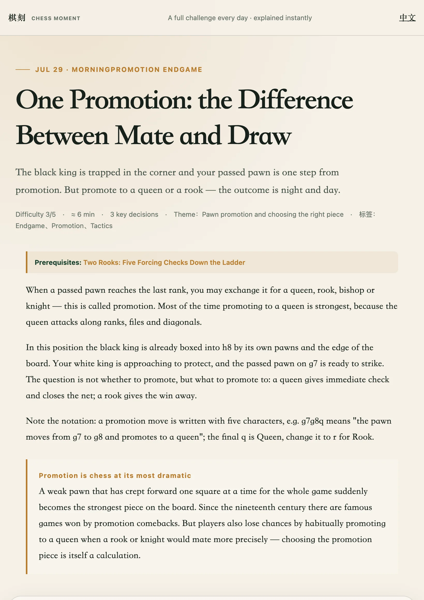

# 双语站点（Bilingual Site）

## 概述

全站中英双语：中文页在根目录，英文页在 `en/` 子目录，文件名一一对应。首次访问按浏览器语言自动进入对应版本，页头按钮随时切换并记住偏好。

## 背景

最初内容只有中文。英文课程内容在 2026-08-14（`42c6631`）先补齐到课程 JSON（`*_en` 字段），随后同日完成页面级双语（`700f91d`）：构建器输出两套页面、UI 文案字典化、语言检测与切换。

## 问题

1. 课程叙述、错误解释、复盘都是长文案，翻译必须与课程数据同源，不能二次维护一套英文页面。
2. UI 文案散落在 HTML 模板与 JS 里会漂移，需要单一字典。
3. 中英读者应各自「直接落地」到自己的语言，而不是都看中文再手动切换。

## 目标

- 一份课程 JSON 同时生成中英两页，语言由构建决定（`<html lang>` 定死），前端无运行时翻译。
- 自动检测：localStorage 偏好优先，其次 `navigator.language`（`zh*` → 中文、`en*` → 英文，其余默认中文）。
- 切换按钮指向兄弟页（`/foo.html` ⇄ `/en/foo.html`），带 `hreflang`，点击时写入 localStorage。
- 中文输出与历史版本字节级保持一致的结构（风险控制：双语化不改变中文站行为）。

## 不解决的问题

- 不做运行时语言切换（切语言 = 跳转到兄弟页）。
- 不支持中英之外的语言（i18n 层已参数化，但暂无需求）。
- 不翻译 `doc/` 历史文档与公众号输出。

## 解决方案概述

- `assets/i18n.mjs`：`UI` 字典（棋子名、状态文案、按钮、设置面板、赞赏等全部 UI 文案）+ `resolveLanguage` / `siblingPath` 纯函数。构建脚本与前端 import 同一份字典，避免两处维护。
- `scripts/build-site.mjs` 的 `renderLesson(lesson, { locale })`：同一模板渲染两种语言，英文页资源路径加 `../` 前缀；`localizeLesson` 按 locale 选取 `*_en` 字段。
- `<head>` 内嵌非 module 检测脚本尽早执行 `location.replace`，避免先渲染再跳的闪烁；逻辑与 `resolveLanguage`/`siblingPath` 保持一致。

## 详细行为

- 语言检测在每页 `<head>` 内联执行：`localStorage.chessMomentLang` 为 `zh`/`en` 时优先；否则按 `navigator.language` 前缀判断；默认中文。
- 页头切换按钮与自动跳转都使用兄弟页相对路径，兼容 Pages 子路径部署（`/chess-moment/…` ⇄ `/chess-moment/en/…`）。
- 教练回答语言跟随页面语言（`currentLang()`）。

## 兼容性与历史影响

- 中文页输出刻意保持与双语化之前相同的字符串与结构（`adc086d` 重新生成根目录 HTML 验证过）。
- 自动跳转改变了「直接访问中文页」的行为：英文浏览器会被 `location.replace` 到 `en/` 版本。这是该功能的语义本身，且手动切换一次即可记住偏好；无 URL 失效问题。

## 数据与隐私影响

新增 localStorage 键 `chessMomentLang`，仅存语言偏好。无网络请求。

## 当前限制

- 语言切换是页面级跳转，挑战进行中的棋盘状态不会跨语言保留。
- `doc/`、公众号正文未双语化。

## 发布信息

上线版本：Unreleased（2026-08-14）

状态：稳定

## 相关文档

- [使用指南：语言切换](../usage.md#语言切换)
- [架构说明：语言路由](../architecture.md#语言路由)
- 测试：`tests/i18n.test.mjs`

## 功能变更记录

### 2026-08-14

首次上线：课程 JSON 英文文案、`en/` 页面、自动检测、手动切换；补充本地化与语言路由测试。
